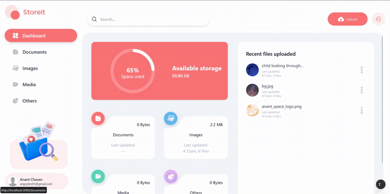

- StoreIt is a storage system for cloud based storage needs.
- Always wanted to work on a Google Drive clone after 2022 and now here it is.

## 📸 Demo


## 🚀 Features
- OTP based login and authentication
- 📝 File type categorization
- 🤝 File sharing
- 📱 Responsive Design

## 🛠️ Tech Stack
**Language:**
- TypeScript

**Framework/Libraries:**
- ReactJS for frontend
- NextJS
- Appwrite 
- Lucide-React
- Recharts

**Style:**
- TailwindCSS
- ShadCN for components

## Installation

1. Clone the repo
```bash
git clone https://github.com/anantl911/storeit.git
```

2. Install dependencies
```bash
npm i
```

3. Appwrite process
   - Create a storage bucket and a database for your project.
   - Get all IDs and create a `.env` file with the following variables:
   
   ```
   NEXT_PUBLIC_APPWRITE_PROJECT_ID 
   NEXT_PUBLIC_APPWRITE_PROJECT_NAME
   NEXT_PUBLIC_APPWRITE_DATABASE
   NEXT_PUBLIC_APPWRITE_TABLE_USERS
   NEXT_PUBLIC_APPWRITE_TABLE_FILES
   NEXT_PUBLIC_APPWRITE_BUCKET 
   NEXT_PUBLIC_APPWRITE_ENDPOINT
   NEXT_APPWRITE_SECRET 
   ```
   - Create the two tables with schemas provided below.

4.Run the project
   ```
   npm run dev
   ```
You will now be able to access the project at `localhost:3000` (assuming the port config remains unchanged).
  
## Schemas

### 📁 File Schema (`files` Collection)
| Field | Type | Description |
|:------|:-----|:-------------|
| **$id** | String | Unique identifier for the file |
| **name** | String | Original file name |
| **url** | String | Public or internal access URL |
| **type** | String | MIME type or general file category |
| **bucketFileId** | String | Reference ID of the file in Appwrite storage bucket |
| **accountId** | String | Linked account or project ID |
| **extension** | String | File extension (e.g. `pdf`, `jpg`, `mp4`) |
| **size** | Integer | File size in bytes |
| **owner** | String | ID of the user who uploaded the file |
| **users** | Array | List of user IDs with shared access permissions |
| **$createdAt** | Date | Timestamp of file creation |
| **$updatedAt** | Date | Timestamp of last modification |

### 👤 User Schema (`users` Collection)
| Field | Type | Description |
|:------|:-----|:-------------|
| **$id** | String | Unique identifier for the user |
| **fullName** | String | Full name of the user |
| **email** | String | Registered email address |
| **avatar** | String | Profile image URL or Appwrite file reference |
| **accountId** | String | Linked account or organization ID |
| **files** | Array | File IDs owned or shared with the user |
| **$createdAt** | Date | Timestamp of user creation |
| **$updatedAt** | Date | Timestamp of last update |

## Development Roadmap

If you wish to contribute to this project, you're welcome. Following are the features/issues post the introduction/fix of which I'll conclude completion of this project. 🤝

**Features:**
1. File grouping/Custom folders
2. Dark mode
3. Account customization options, i.e name change, password based logins.
4. Structured ownership and sharing roles.
5. Redis caching to reduce API calls and rate limiting APIs.

**Issues**
1. No acccount login and registration separation
2. Shared files can be modified and deleted by non-owners.
3. Dashboard total usage summary not working.

## Special Thanks to JSMastery
I followed along this tutorial to make this project.
https://www.youtube.com/watch?v=lie0cr3wESQ
- My key learnings from this project:
```
- Project folder structuring
- Using linter for proper code formatting.
- Maintaining proper css and global style formatting.
- Writing APIs and components for reusability.
```

## Author
Anant Chavan
